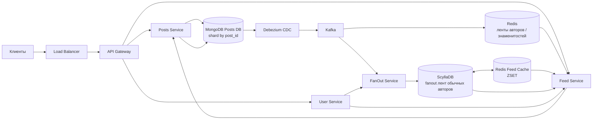

# Спецификация: публикации и главная лента

## Контекст
Сервис публикаций и главной ленты для социальной сети с 50 млн зарегистрированных пользователей.
Система доставляет подписчикам публикации авторов в обратном хронологическом порядке.

## Функциональные требования
- **ФТ1. Публикация поста:** автор публикует фотографию с метаданными после загрузки файла.
- **ФТ2. Подписки:** пользователь подписывается на автора и отписывается от него.
- **ФТ3. Главная лента:** пользователь получает посты текущих подписок по убыванию времени, по 20 на страницу.
- **ФТ4. Новая подписка:** пользователь видит до 20 последних постов автора за последние семь дней.
- **ФТ5. Удаление поста:** удалённый пост исчезает из новых ответов ленты в течение минуты.
- **ФТ6. Отписка:** посты автора перестают попадать в новые ответы ленты в течение минуты после отписки.

**Вне скоупа:** рекомендации, реклама, Stories, сообщения, ранжирование, загрузка и доставка файлов.

## Нефункциональные требования
- **Аудитория:** 50 млн зарегистрированных пользователей, 10 млн активных пользователей в день; MAU не задан.
- **Нагрузка:** 100 млн чтений ленты и 2 млн публикаций в сутки; пик для оценки — 10× среднего.
- **Задержка публикации:** после загрузки фотографии p95 ≤ 500 мс, p99 ≤ 1 с.
- **Задержка ленты:** первая страница метаданных p95 ≤ 300 мс, p99 ≤ 1 с; загрузка изображений измеряется отдельно.
- **Доступность ленты:** за каждые 30 дней успешно завершаются не менее 999 500 из 1 000 000 запросов; это 99,95% доступности и до 21 мин 36 с простоя при равномерной нагрузке.
- **Доступность публикации:** за каждые 30 дней успешно завершаются не менее 999 000 из 1 000 000 запросов; это 99,9% доступности и до 43 мин 12 с простоя при равномерной нагрузке.
- **Полнота ответа:** ответ ленты не должен молча терять доступные публикации; дубликаты запрещены.
- **Надёжность записи:** подтверждённая публикация не должна быть потеряна при сбое.
- **Своевременность:** новая публикация появляется у подписчиков в течение 60 секунд в обычной ситуации.
- **Свежесть удаления:** удаление поста и отписка отражаются в новых ответах ленты в течение 60 секунд.
- **Хранение:** записи лент хранятся 30 дней; срок хранения постов — до удаления.
- **Размер данных:** размер метаданных не задан и требует измерения; фотографии хранятся вне Posts DB.

## Расчёты
- **Публикации:** `RPS_avg = 2 000 000 / 86 400 = 23,1`; `RPS_peak = 23,1 × 10 = 231`.
- **Чтение ленты:** `RPS_avg = 100 000 000 / 86 400 = 1 157`; `RPS_peak = 1 157 × 10 = 11 574`.
- **Fanout обычных авторов:** `2 000 000 постов/сутки × 200 подписчиков = 400 млн записей/сутки`.
- **Скорость fanout:** `400 000 000 / 86 400 = 4 630 записей/с avg`; `4 630 × 10 = 46 300 записей/с peak`.
- **Fanout знаменитости:** `20 млн подписчиков × 1–3 поста/день = 20–60 млн доставок/день` одному автору.
- **Хранение feed-записей:** `400 млн/день × 30 дней = 12 млрд записей`; объём в байтах зависит от размера строки и индексов.
- **Трафик чтения:** `11 574 запросов/с × средний размер ответа`; размер метаданных неизвестен, изображения считаются отдельно.

**Вывод:** чтение требует распределённого хранилища лент и кэша; для знаменитостей fanout заменяется чтением их публикаций при сборке ленты.

## Архитектура
- **API Gateway:** направляет запросы между Posts, Feed и User Service за балансировщиком нагрузки.
- **Posts Service:** сохраняет метаданные публикаций в основной MongoDB, шардированной по post_id.
- **MongoDB CDC:** Debezium читает изменения Posts DB и передаёт события в Kafka.
- **Kafka:** долговечный журнал событий с отдельными consumer-потоками в Redis и FanOut Service.
- **Redis авторов:** кэширует ленты собственных публикаций авторов, прежде всего знаменитостей.
- **FanOut Service:** пропускает знаменитостей; посты остальных авторов раскладывает по лентам подписчиков.
- **ScyllaDB:** хранит fanout-записи обычных авторов с ключом пользователя и сортировкой по времени; срок хранения — 30 дней.
- **Redis лент:** кэширует горячие ленты обычных пользователей поверх ScyllaDB с помощью sorted sets.
- **User Service:** предоставляет данные пользователей и подписок для fanout и сборки ленты.
- **Feed Service:** объединяет записи ScyllaDB и публикации знаменитостей из Redis, получает метаданные и фильтрует удалённые посты.
- **Пагинация:** курсор по `(created_at, post_id)` обеспечивает стабильное чтение без OFFSET.
- **Удаление:** tombstone немедленно исключает пост из ответов; очистка хранилищ выполняется асинхронно.
- **Отписка:** Feed Service учитывает актуальную подписку; устаревшие fanout-записи удаляются фоново.
- **Идемпотентность:** consumers Kafka допускают повторы без появления дубликатов в ленте.
- **Масштабирование:** MongoDB шардируется по post_id, ScyllaDB — по viewer_id, Kafka — по ключу события.

### Потоки данных

## Требования к оборудованию

### MongoDB
- **Количество шардов:** 10.
- **Узлы на шард:** 4 сервера, всего 40 серверов MongoDB.
- **Диск на узел:** 10 ТБ, всего 400 ТБ сырой дисковой ёмкости.
- **Оперативная память на узел:** 512 ГБ, всего 20 480 ГБ RAM (≈20 ТиБ) для MongoDB.
- **Полезная ёмкость:** меньше 400 ТБ после репликации, системного резерва и служебных данных; коэффициент репликации нужно зафиксировать при закупке.

### Redis для лент авторов
- **Количество узлов:** 3.
- **Данные на узел:** 250 ГБ для кэша собственных лент авторов, прежде всего знаменитостей.
- **Оперативная память на узел:** 512 ГБ, всего 1 536 ГБ RAM (≈1,5 ТиБ).

### Redis для fanout и счётчиков
- **Количество узлов:** 3.
- **Данные на узел:** 250 ГБ для fanout-кэшей и кэшей пользовательских счётчиков.
- **Оперативная память на узел:** 512 ГБ, всего 1 536 ГБ RAM (≈1,5 ТиБ).

### Redis для горячих лент
- **Количество узлов:** 3.
- **Данные на узел:** 128 ГБ для ZSET-кэша горячих лент обычных пользователей.
- **Оперативная память на узел:** 256 ГБ, всего 768 ГБ RAM (≈0,75 ТиБ).

### Сводный объём
- **Серверы MongoDB:** 40 узлов, 400 ТБ сырого диска и 20 480 ГБ RAM.
- **Серверы Redis:** 9 узлов, до 1 884 ГБ суммарных лимитов данных и 3 840 ГБ RAM.
- **Итого по MongoDB и Redis:** 49 серверов, 400 ТБ сырого диска MongoDB и 24 320 ГБ RAM (≈23,75 ТиБ).
- **Допущение по Redis:** объёмы 250 ГБ и 128 ГБ указаны на один узел; полезная ёмкость кластера зависит от репликации и резерва памяти.
- **Не включено:** серверы ScyllaDB, Kafka, Debezium, API и приложений, балансировщики, резервное копирование и S3-like хранилище; их количество и конфигурация не заданы.
- **Не заданы для закупки:** CPU, сеть, тип и производительность дисков, схема репликации MongoDB и Redis persistence.

## Ключевые решения
- **Обычные авторы:** публикации распространяются в ленты подписчиков через Kafka и FanOut Service.
- **Знаменитости:** публикации не размножаются по миллионам лент; Feed Service добавляет их при чтении.
- **Удаление и отписка:** актуальное состояние проверяется при чтении, фоновая очистка удаляет устаревшие записи.
- **Цели доступности:** не более 500 неуспешных запросов ленты и 1 000 запросов публикации на каждый миллион за 30 дней.
